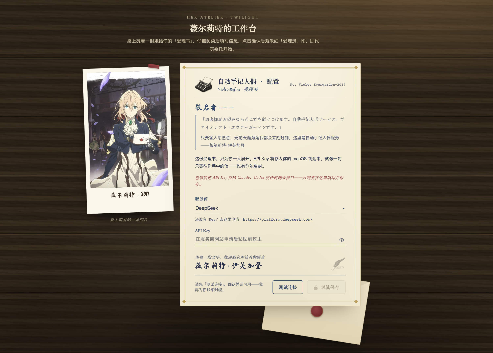
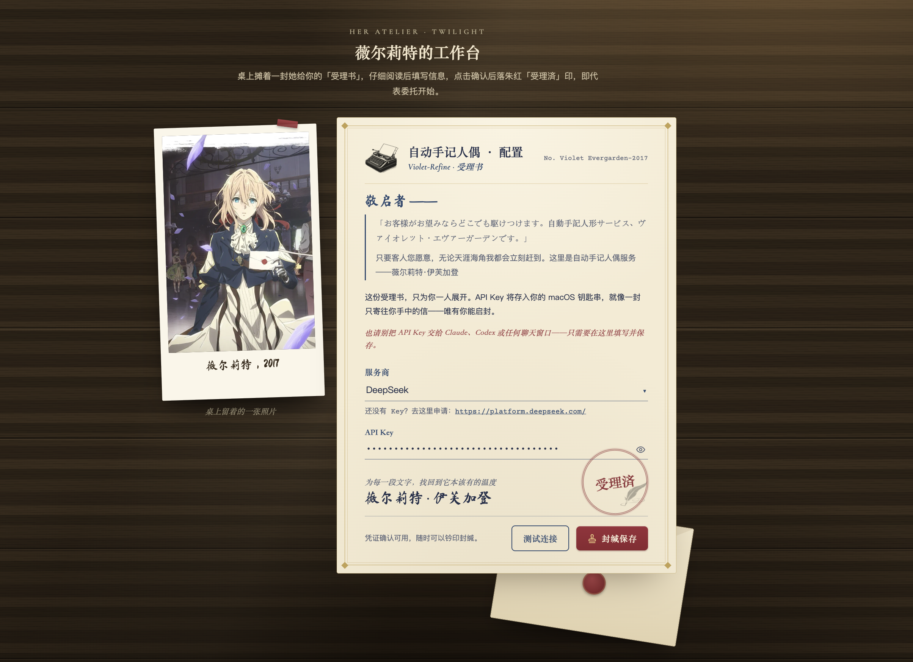

# Violet-Refine

<p align="center">
  
</p>

> *「我是自动手记人偶，薇尔莉特·伊芙加登。」*
> *——只要客人您愿意，无论天涯海角我都会立刻赶到。*

*这个插件名字的灵感来自《紫罗兰永恒花园》* 里的薇尔莉特·伊芙加登，她是一名**自动手记人偶**——替不识字、不善写作的人代笔，将内心深处所思所想传递给收信人。她曾是只会服从命令的士兵，不解人心，不懂表达。后来在一封封代笔信里，学会了如何用文字传递温度，理解了何为爱意。

Violet-Refine Skill 就是这样类似的设定：

> 拿到一段 AI 味重的中文内容 → 读懂它想说什么 → 用自然的表述写出来。
> **不改原意。让文字回到该有的样子。**

它是一个运行在 Claude Code、Codex 等 Agent 里的中文日常办公内容润色工坊。
当你提出「润色一下」「去 AI 味」「改自然点」等需求时，它就会出现。

比起把 Claude Code、Codex 等的产出复制粘贴到 DeepSeek 官网润色或者手动去改 Agent 模型配置，Violet-Refine 以 Skill 形式直接在当前 Agent 的对话里完成全流程——不用切窗口，不用反复粘贴，让你的工作心流不被干扰打断。

---

## 来信

<p align="center">
  
</p>

在 Agent 里每一天都有人这样提问：

> 「这段改成更自然的样子。」
> 「AI 味太重了，你要避免xxx。」
> 「好多用词是生硬翻译腔，重新修改。」

近几个月，海外前沿模型中文输出的" AI 味" 问题在变严重。尤其是在 GPT-5.4、Claude 4.7 之后，模型 Coding 与 Agentic 能力越强，中文产出的 AI 味也越来越重。

目前主要集中在三个方面：

| 通病 | 症状 | 怎么认出来 |
|------|------|-----------|
| 🫧 AI 腔 | 「稳稳接住」「不是...而是」「核了一下」 | 不像在听人说话 |
| 🌐 翻译腔 | 英式长句堆叠，被动语态泛滥 | 句子很长但信息密度很低 |
| 🎈 冗余 | 三个字能讲清的事用了三行 | 「在当前阶段的实际操作过程中」→ 其实就「现在」 |

Violet-Refine 就是为这类现象开的药方，最适合对日常办公的文字文档进行润色。

---

## 三个模式

Violet-Refine skill 自带三个模式，从轻到重，供你选择：

```
轻 ←──────────────────────────────→ 重

  ✏️ proofread       🖊️ refine        🖌️ rewrite
   只改错字           去 AI 味          重组段落
```

| | proofread | refine | rewrite |
|---|-----------|--------|---------|
| 默认模式 | | ⭐ | |
| 错别字 | ✅ | ✅ | ✅ |
| 标点语法 | ✅ | ✅ | ✅ |
| 去 AI 腔 | | ✅ | ✅ |
| 去翻译腔 | | ✅ | ✅ |
| 压缩冗余 | | ✅ | ✅ |
| 重组段落 | | | ✅ |
| 原文核心含义 | **不动** | **不动** | **不动** |

三种模式一个底线：**不改原意，不塞私货。**

---

## 代笔工坊

<p align="center">
  
</p>

Violet-Refine 分两层执行你的委托：

```
你："润色一下"
       ↓
  ┌─────────┐      ┌─────────┐      ┌──────────┐
  │ Skill    │ ───▶ │ CLI 内核 │ ───▶ │ DeepSeek │
  │ 交互层   │      │ 执行层   │      │ 审阅·润色 │
  └─────────┘      └─────────┘      └──────────┘
  理解内容           匹配规则          独立审阅
  确认意图           组装 prompt       生成改稿
```

结果沿原路返回，Skill 把改稿交付给你。

| 层 | 文件 | 管什么 | 像什么 |
|----|------|--------|--------|
| 交互层 | `SKILL.md` | 读你的文、问清需求、选 mode | **接信的柜台**——听你说想要什么效果 |
| 执行层 | `src/violet_refine/` | 组 prompt、调模型、出结果 | **后面的工作间**——真正动手改字 |


### 换一双眼睛

一个模型写的东西，同一个模型很难读出自己的 AI 腔——像人听不出来自己的口音。Claude 难以察觉 Claude 腔，GPT 也闻不到 GPT 味。

所以 Violet-Refine 的核心设计是：**用不同源的模型做 review 和润色。**

你日常在 Claude Code 或 Codex 工作，背后的主力模型是 Claude 或 GPT。Violet-Refine 调另一类模型独立读输出的文字文档——换一个训练语料体系里的眼睛来看：「这段话哪里不像人写的」。

Skill 可调用外部模型 API. 配置 key 是通过拉起本地页面快速配置，不用命令行，也避免 key 这类敏感信息直接被 AI 拿到。

### 工作间的 API 管线

首批支持使用 **DeepSeek V4 Pro** 官方 API 调用。

我们推荐使用不同源的模型进行写作质量review。例如 Violet-Refine 默认用 DeepSeek review Claude 或 GPT 的产出——比同模型自己改自己要有效得多。不同源的模型能抓到那些在对方训练分布里「看起来似乎没毛病」的写法。

选 DeepSeek V4 Pro 做首批支持是因为：中文写作润色对模型有两个基本要求——基座的世界知识要够丰富，中文写作语料的积累要够深，两者缺一不可。DeepSeek V4 Pro 的参数量带来了足够的世界知识覆盖，加上它在中文写作语料上下过功夫，拿它改 Claude 和 GPT 的中文产出，效果最稳。

---

## 三本规则书

润色的标准不是「凭感觉」，是三层规则逐层收紧：

```
  ┌───────────────────────┐
  │ 📘 场景软约束 C01–C08  │  ← 按语境选用
  ├───────────────────────┤
  │ 📕 强规则 S01–S10      │  ← refine / rewrite 生效
  ├───────────────────────┤
  │ 📗 写作通则 G01–G07    │  ← 所有模式生效
  └───────────────────────┘
```

### 第一本 · 写作通则（G01–G07）

所有模式生效，校阅办公文档类写作基本原则

### 第二本 · 强规则（S01–S10）

refine 和 rewrite 生效，对 AI 味精准打击：

直接禁掉的写法——

```
在当今时代 → 这两年 / 现在
赋能 / 助力 / 落地 → 换成人话
"不是...而是..." → 避免滥用
```

### 第三本 · 场景约束

每次按当前语境智能匹配 2–3 条场景化约束规则：

- README 不写「赋能」
- 技术文档不写「助力」
- 发布说明可以口语化，但语气避免像聊天记录

规则全在 `references/` 里，打开就能看、也可以进行修改。后续会增加记忆功能与自主更新融合新偏好规则的能力。

---

## 邀请 Violet 进驻你的 Agent

### 前提

- Python 3.11+
- [uv](https://docs.astral.sh/uv/)
- 至少一个 LLM provider 的 API Key（目前支持 [DeepSeek](https://platform.deepseek.com/)，需在官网注册账号并创建 Key）

### 三步走

```bash
# 1. 把 Skill 文件夹搬过去
cp -r violet-refine ~/.claude/skills/
# 或
cp -r violet-refine ~/.codex/skills/

# 2. 配置 API Key（会直接弹出本地网页）
violet-refine/scripts/violet-refine auth --ui
```

<table align="center">
  <tr>
    <td align="center">
      
      <br><sub>受理書 — 等待委托</sub>
    </td>
    <td align="center">
      
      <br><sub>受理済 — 封缄完成</sub>
    </td>
  </tr>
</table>

选好服务商（目前仅首批支持 DeepSeek）、填入 Key，点击「测试连接」通过后再点「封缄保存」。Key 就会存进系统钥匙串，不会被当前 AI 读取。

```bash
# 3. 在 Claude Code、Codex 等 agent 里直接调用，例如
/violet-refin - 直接唤出 SKill
或者提需求 "帮我润色一下这段"
```

### 日常使用场景

- **随手润色**：Agent 刚输出了一段中文回复或草稿，你觉得 AI 味重，直接调用 Skill 说「润色一下」，Skill 当场接手进行润色
- **文档精修**：已经写好一篇纪要、邮件或周报等文档，直接在 Agent 里丢给 Skill 进行 review，看清问题清单后与 Skill 协作决定下一步优化方案

全程不离开你当前 Agent 工作环境，润色就是对话里的一句话，不打断你正在做事的心流。

### 在 CLI 也能用

```bash
# 先出审阅报告——看哪些地方要改，改哪里，为什么
violet-refine/scripts/violet-refine run --workflow review --mode refine \
  --brief "读者：第一次看到仓库的开发者\n目的：快速了解有哪些工具\n语域：中性偏口语" \
  --file input.md

# 按审阅建议出改稿
violet-refine/scripts/violet-refine run --workflow direct --mode refine \
  --format text --review-context /tmp/review.txt \
  --brief "..." --file input.md
```

如果有明确的背景信息和意图，可以通过 `--brief` 参数告诉 Skill。日常使用推荐走 Skill 的完整流程——它会智能分析意图和文档内容场景，自动完成润色。

---

## 后续 Roadmap

- [ ] 记忆偏好：积累用户的写作习惯和偏好，自主优化迭代规则库
- [ ] 更多模型 provider 支持
